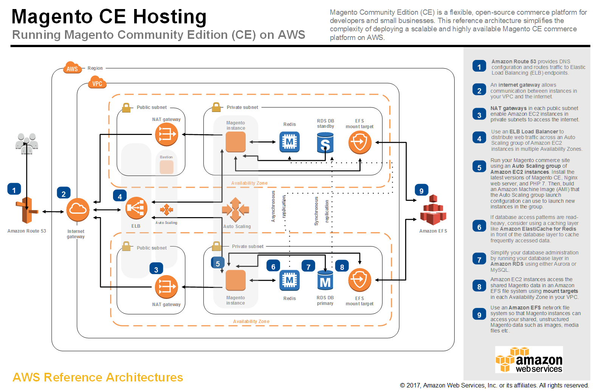

# Hosting Magento on AWS

This reference architecture provides a set of CloudFormation templates to deploy Magento Community Edition on the AWS Cloud.

Magento is an open-source content management system for e-commerce websites. This automated deployment builds a cluster that runs Magento along with optional sample data, which lets you experiment with custom themes and view the web store.

You can launch this CloudFormation stack, using in your own account into: -
  * A new VPC - 
  * An existing VPC - 

## Overview

This reference architecture deploys Magento using AWS CloudFormation templates and offers two options: you can build a new AWS infrastructure for your Magento stack, or deploy Magento into your existing AWS infrastructure. The deployment uses MySQL on Amazon RDS for database operations, Amazon EFS for shared storage between EC2 instances, and an Amazon ElastiCache cluster with the Redis cache engine to improve application load times. The Magento stack deployed using the templates provided here comes with Amazon Pay plugin,  pre-installed.

You can use the AWS CloudFormation templates included here to deploy a fully configured Magento infrastructure in your AWS account. This reference architecture automates the following:
  * Deploying Magento Community Edition into a new VPC
  * Deploying Magento Community Edition into an existing VPC
  
You can also use the AWS CloudFormation templates as a starting point for your own implementation.

For architectural details, best practices, step-by-step instructions, and customization options, see the [deployment guide](http://docs.aws.amazon.com/quickstart/latest/magento/welcome.html)

